# Linux and Command Line Course

##Michael Phelps

### Lab Responses

---

## Lab 1

1. **List files of /var/lib**

   ```
   cd /var/lib
   ls (or ls -l depending on what you want to see)

   ```

   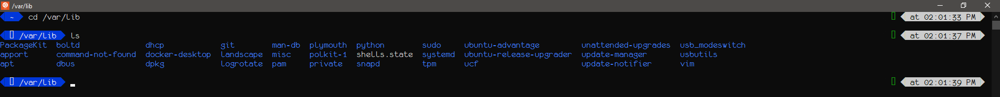

2. **Change current directory to your home directory**
   `cd ~`
   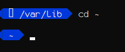
3. **Check content of file(/var/log/apt/history.log**

   ```
   cat /var/log/apt/history.log

   or

   tail /var/log/apt/history.log

   or

   head /var/log/apt/history.log

   ```

   (Only screenshotting head, due to size of file)
   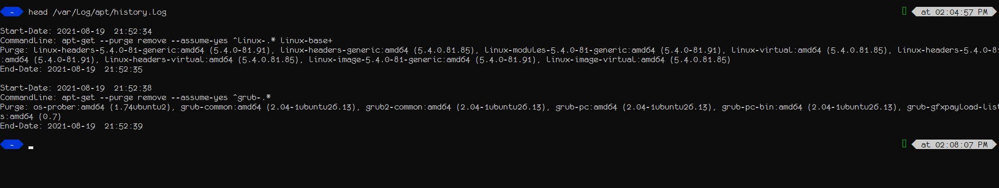

   4, 5, 6 (combined):
   **Create a file (/home/**user**/linuxtraining)
   Rename file to trainingLinux
   Delete the file**

   ```
   cd ~
   touch linuxtraining
   mv linuxtraining trainingLinux
   rm trainingLinux

   ```

   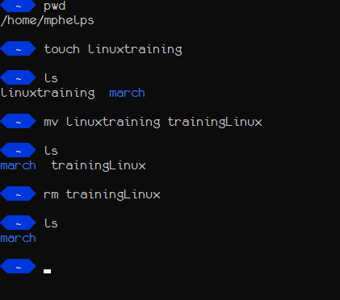

4. **Count the number of files in /etc**
   ```
   ls /etc | wc -l
   ```
   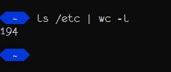
5. **Use more and less commands for /var/log/apt/history.log**
   (because of the length of the file, and how this command runs, no screenshotting)

   ```
   more -d /var/log/apt/history.log (shows menu at the bottom)
   less /var/log/apt/history.log

   ```

   ***

   ## Lab 2

6. **Create a file which has read permission for user and group only**

```
touch newFile
chmod 440 newFile
```

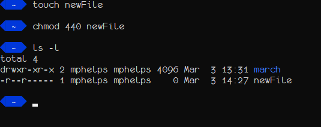

2. **Create a file that has write permission for user only**
   ```
   touch userOnly.txt
   chmod 200 userOnly.txt
   ```
   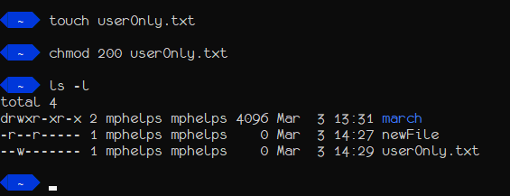
3. **Create a directory where everyone can enter, but only user can execute**

```
mkdir labDir
chmod 544 labDir
```

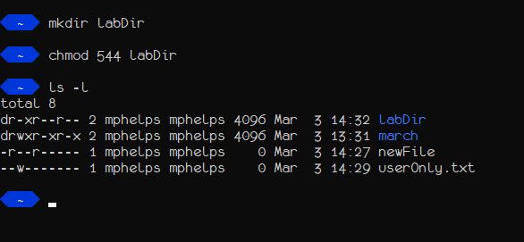

4. **Repeat the above steps with numbers**
   (since I did the above steps IN numbers, here's the chmod commands for each)

```
chmod u+r,g+r newFile
chmod u+x userOnly.txt
chmod u+rx,go+r labDir
```

---

## Lab 3

1. **Create a file that displays the following information on execution:**
   ```
   touch myInfo.txt
   echo -e "echo 'Michael Phelps\n' '$(date)\n' '$(hostname)\n'  '$(id -u)\n' '$(uptime)\n'" > myInfo.txt
   chmod 744 myInfo.txt
   ./myInfo.txt
   ```
   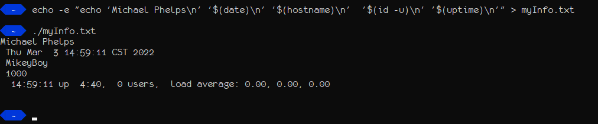
2. **Write a simple script which will execute below commands in order**

   ```
   #!/bin/bash
   # Simple Script

   uptime
   id
   whoami
   pwd
   uname -a
   echo "Copying file1.txt to file2.txt"
   cp file1.txt file2.txt
   ```

   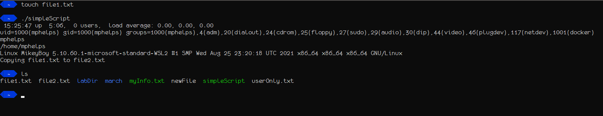

3. **Using tail and head print top 2 lines of last 10 lines of /var/log/apt/history.log**

   ```
   tail -n2 /var/log/apt/history.log
   head -n2 /var/log/apt/history.log
   ```

   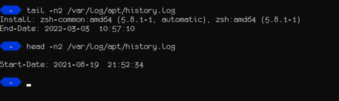

---

## Lab 4

Ran out of time
